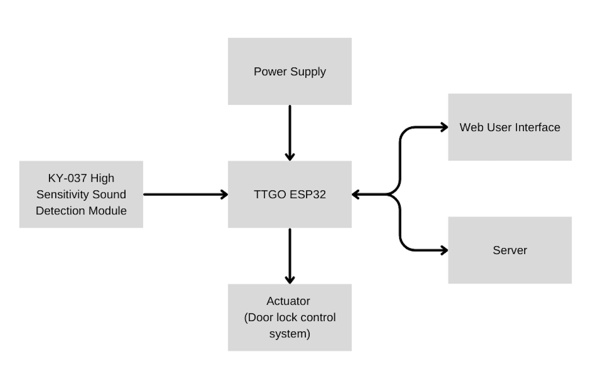

# Glass Breakage Monitoring System

In September 2024, the Concordia Hall building was vandalized during a violent protest, resulting in shattered lobby windows. It inspired me to develop a prototype glass breakage monitoring system using an ESP32 and sound sensors, which alerts a server in real time via WebSocket when damage is detected.

## Demo Video

## System Architecture

