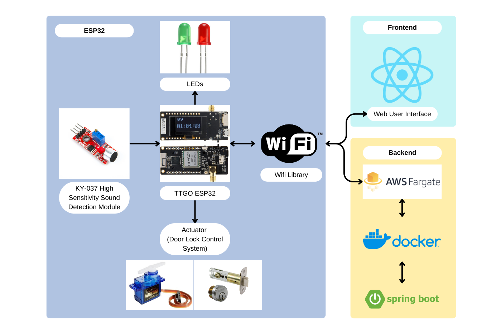
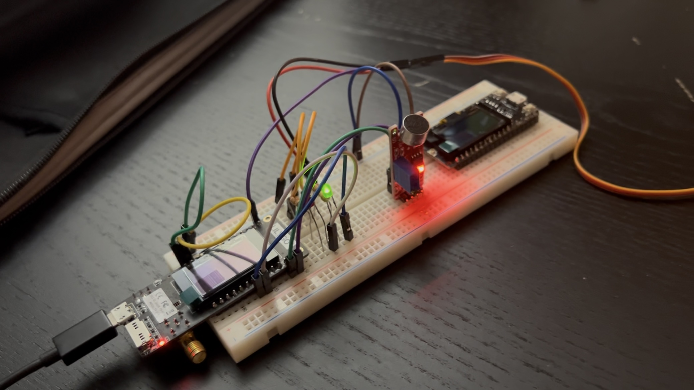
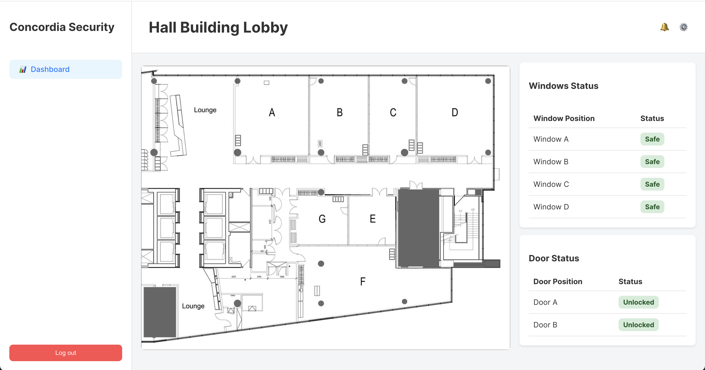

# Glass Breakage Monitoring System

In September 2024, the Concordia Hall building was vandalized during a violent protest, resulting in shattered lobby windows. It inspired me to develop a prototype glass breakage monitoring system using an ESP32 and sound sensors, which alerts a server in real time via WebSocket when damage is detected.

## System Architecture

The system comprises 3 elements:

- Frontend (React)
- Backend (Java Spring Boot, AWS Fargate, Docker Container) using WebSocket
- ESP32 with sound sensor module and LEDs

WebSocket was chosen to retrieve and push data in real-time, due to the nature of the problem.

## ESP32 and Modules

## Web User Interface (Front-End)

## Demo Video

